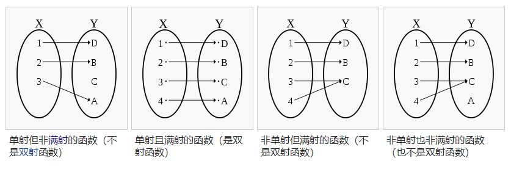

[TOC]

# 抽象代数 Abstract Algebra

## Contents
- [抽象代数 Abstract Algebra](#抽象代数-abstract-algebra)
  - [Contents](#contents)
- [1. 集合的定义](#1-集合的定义)
  - [定义1：包含$\subseteq$](#定义1包含subseteq)
  - [定义2：相等$=$](#定义2相等)
  - [定理1：](#定理1)
  - [定理2：](#定理2)
- [2. 集合的运算](#2-集合的运算)
  - [定义3：并集$\cup$](#定义3并集cup)
  - [定义4：交集$\cap$](#定义4交集cap)
  - [定理3：](#定理3)
  - [定理4：](#定理4)
  - [定理5：](#定理5)
  - [定理6：](#定理6)
  - [定义5：索引集](#定义5索引集)
  - [定理7：](#定理7)
  - [定义6：卡式积](#定义6卡式积)
  - [定义7：不交并](#定义7不交并)
  - [定义8：幂集](#定义8幂集)
- [3. 集合间的关系](#3-集合间的关系)
  - [定义9：关系](#定义9关系)
  - [定义10：相等关系](#定义10相等关系)
  - [定义11：偏序关系](#定义11偏序关系)
  - [定义12：等价关系](#定义12等价关系)
  - [定义13：等价类](#定义13等价类)
  - [定理8](#定理8)
  - [定理9](#定理9)
  - [定义14：商集](#定义14商集)
- [4. 映射](#4-映射)
  - [定义15：映射](#定义15映射)
- [5. 罗素悖论](#5-罗素悖论)
- [6. 势与基数](#6-势与基数)
  - [定义势Cardinality](#定义势cardinality)

# 1. 集合的定义

| 中文 | 符号 | 英文 |
| :---: | :---: | :---: |
|朴素集合论||Naive Set Theory|
|空集|$\emptyset$|Empty Set|
|空虚的真|| Vacuous Truth|
|子集| $\subseteq$ | Subset|
|属于|$\in$||
|对于所有|$\forall$||

给定一个对象，能否判断其是否属于集合？

元素，集合里面的个体

$x \in A$

整数集：$\mathbb{Z}$   
自然数集：$\mathbb{N}$

**所有对空集进行的全称命题都是真命题**：
$\forall x \in \varnothing, \ldots$

## 定义1：包含$\subseteq$

$$
A \subseteq B, 当且仅当 \forall x \in A, x \in B.
$$

## 定义2：相等$=$
$$
A = B, 当且仅当 A \subseteq B 且 B \subseteq A.
$$

## 定理1：
$$
\emptyset \subseteq A, A 是任意集合
$$

## 定理2：
$$
只有一个\emptyset
$$

# 2. 集合的运算

| 中文 | 符号 | 英文 |
| :---: | :---: | :---: |
| 并集 | $\cup$ ||
| 交集 | $\cap$ ||
| 补集 | $A^c$ ||
| 索引集 ||index|

## 定义3：并集$\cup$

$$
A \cup B = \{ x \in A 或者 x \in B \}
$$

## 定义4：交集$\cap$

$$
A \cap B = \{x \in A 并且 x \in B \}
$$

## 定理3：
$$
(A \cup B) \cup C = A \cup (B \cup C)
$$

## 定理4：
$$
(A \cap B) \cap C = A \cap (B \cap C)
$$

## 定理5：
$$
A \cup B = B \cup A \\
A \cap B = B \cap A
$$

## 定理6：
$$
(A \cup B) \cap C = (A \cap C) \cup (B \cap C) \\
(A \cap B) \cup C = (A \cup C) \cap (B \cup C)
$$

## 定义5：索引集
$$
\{ A_\alpha | \alpha \in I \} 其中 I 是索引集。\\
对所有的 A_\alpha 并集：\bigcup_{\alpha \in I}A_\alpha \\
\ \\
对所有的 A_\alpha 交集：\bigcap_{\alpha \in I}A_\alpha
$$

## 定理7：
德摩根定律推广：
$$
A_\alpha \subseteq U,\\
\ \\
(\bigcap_{\alpha \in I}A_\alpha)^c = \bigcup_{\alpha \in I} A_{\alpha}^c \\
\ \\
(\bigcup_{\alpha \in I}A_\alpha)^c  = \bigcap_{\alpha \in I}A_{\alpha}^c
$$

## 定义6：卡式积
定义：
$$
A \times B  = \{ (x, y) | x \in A, y \in B \}
$$
示例：
$$
\begin{aligned}
\mathbb{R} \times \mathbb{R} &= \{(x, y)|x, y \in \mathbb{R} \} \\
&\cong \mathbb{R}^2
\end{aligned}
$$

## 定义7：不交并
$$
A \sqcup B = (A \times \{0\}) \cup (B \times \{ 1\})
$$

## 定义8：幂集
定义：
$$
2^A = \{所有的子集\}
$$

示例：
$$
A = \{ 1, 2 \} \\
\ \\
2^A = \{ \varnothing, \{1 \}, \{2\}, \{1, 2 \} \} \\
\ \\
2^\emptyset = \{ \varnothing \}
$$

思考：
$$
\varnothing \times A = ? \\
A \times \varnothing = ? \\
\varnothing \times \varnothing = ?
$$

# 3. 集合间的关系

`偏序关系`，`等价关系`，`等价类`，`分割`

## 定义9：关系

定义：
$$
A 上面的一个关系是A\times A 的一个子集R。 \\
A \times A = \{ (x, y) | x, y \in A \} \\
(x, y) \in R \quad xRy
$$

关系：
$$
\Delta \subseteq A \times A \\
\Delta = \{(x, x)| x \in A \} \\
对角线 \\
$$

总结:  
这个关系，还是指集合中元素的关系

## 定义10：相等关系
定义：
$$
\Delta 定义了A上元素的相等关系 \\
x \Delta y \Leftrightarrow x = y
$$

## 定义11：偏序关系
$$
A上的一个偏序关系R是符合以下条件的关系： \\
\begin{aligned}
&1. 自反性： \forall x \in A, xRx \\
&2. 反对称性：如果 xRy 且yRx，那么x = y \\
&3. 传递性：如果 xRy 且 yRz，那么xRz
\end{aligned}
$$

示例：
$$
(\mathbb{R}, \leqslant) 是偏序关系  \\
(A, =) 是偏序关系
$$

## 定义12：等价关系
定义：
$$
一个在A上的等价关系符合以下条件： \\
\begin{aligned}
  &1. 自反性：对于 \forall x \in A, xRx \\
  &2. 对称性：如果xRy，那么yRx \\
  &3. 传递性：如果xRy，且 yRz，那么xRz
\end{aligned}
$$

思考题：
$$
2,3 \Rightarrow 1 ?
$$

符号：
$$
等价关系R 用 \sim 表示： \\
xRy记成：x \sim y
$$

## 定义13：等价类
定义：
$$
\begin{aligned}
令 A 为任意集合， \sim &为 A 上的等价关系。 \\
定义: 对于 a \in A, [a] &= \{ b \in A | a \sim b \} \\
&= a的等价类
\end{aligned}
$$

## 定理8
$$
如果[a] \cap [b] \neq \varnothing, 那么 [a] = [b]
$$
证明：

## 定理9
$$
A = \bigcup_{a\in A}[a] \\
\ \\
并且[a]之间互不相交 \\
等价类分割
$$

证明：
$$
\forall a \in A, a \in [a] \Rightarrow a \in \bigcup_{a \in A}[a] \\
[a] \subseteq A \Rightarrow \bigcup_{a \in A}[a] \subseteq A \\
根据定理8，\Rightarrow [a] 互不相交
$$

## 定义14：商集
定义：
$$
\begin{aligned}
  (A, \sim) 定义 A/_{\sim} &= \{ [a] | a \in A \} \\
  &= A 除以 \sim 的商集

\end{aligned}
$$

示例：
$$
\mathbb{Z}中，m \sim n 当且仅当 m \equiv n \bmod a \\
证明：略 \\
\mathbb{Z}/_\sim = \{ 0, 1, 2, \dots, a-1\}
$$

# 4. 映射

`单射` `满射` `双射`  
`等势`  
`卡氏幂`  
$B^A$

## 定义15：映射

定义：
$$
一个从集合A到集合B的映射是A \times B 的一个子集 f，并且符合以下条件： \\
对于任意a \in A，存在唯一的 b \in B 使得(a, b) \in f. \\

\begin{aligned}
f(a) &= b: \quad  f: A \rightarrow B \\
a &\mapsto b
\end{aligned}
$$

# 5. 罗素悖论

# 6. 势与基数

## 定义势Cardinality

无限集合: 与它的真子集存在一一对应关系。

集合的势 = 集合的大小

$$
A与B等势 \Leftrightarrow 存在双射 \\
A与B一一对应

$$

|A|=元素的个数

对每一个等价类[A]，我们用一个符合代替：基数 |A| Cardinal Number

等势是集合和集合的一个等价关系。

参考：
1. https://oeis.org/wiki/List_of_LaTeX_mathematical_symbols

2. https://latex.codecogs.com/eqneditor/editor.php