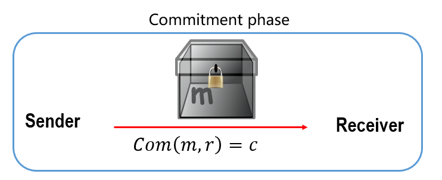
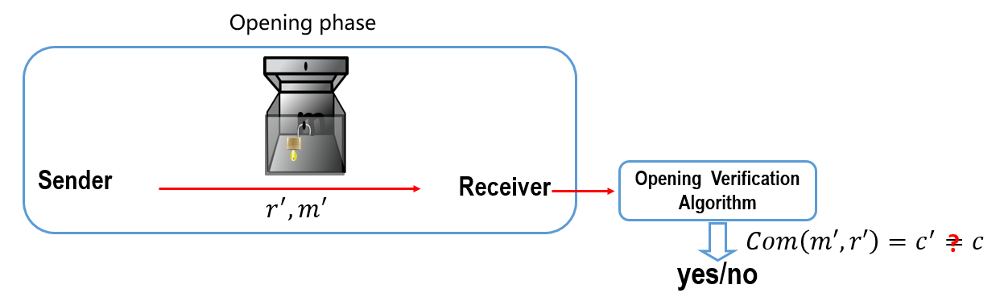

[TOC]

# 门限ECDSA — 多方

该文档主要介绍的是2018年美密的一篇文章“Fast Multiparty Threshold ECDSA with Fast Trustless Setup”。该文章介绍了一个多方的门限ECDSA方案。目前针对于该方案已经实现并开源的项目有ZenGo（rust开发的）。该文章中介绍的方案可以应用在传统的DSA与ECDSA上，但是为了简便以及与其它研究者方案在效率等方面做对比，该文章中依然采用“Threshold-optimal DSA/ECDSA signatures and an application to Bitcoin wallet security”中对DSA方案的记号描述。也就是我们接下来要展示的方案generic G-DSA。

## Contents
- [门限ECDSA — 多方](#门限ecdsa--多方)
  - [Contents](#contents)
- [1. Generic G-DSA](#1-generic-g-dsa)
  - [1.1. 系统参数](#11-系统参数)
  - [1.2. 密钥生成](#12-密钥生成)
  - [1.3. 签名生成](#13-签名生成)
  - [1.4. 验证签名](#14-验证签名)
- [2. 承诺](#2-承诺)
  - [2.1. 定义](#21-定义)
  - [2.2. 两个阶段与两个特性](#22-两个阶段与两个特性)
  - [2.3. Non-Malleable Equivocable Commitments](#23-non-malleable-equivocable-commitments)
- [3. Paillier](#3-paillier)
  - [3.1. 方案介绍](#31-方案介绍)
  - [3.2. 同态属性](#32-同态属性)
  - [3.3. MtA协议（Multiplicative to Additive）](#33-mta协议multiplicative-to-additive)
  - [3.4. MtAwc协议](#34-mtawc协议)
- [4. VSS协议](#4-vss协议)
  - [4.1. 参数介绍](#41-参数介绍)
  - [4.2. Initialization](#42-initialization)
  - [4.3. Distribution](#43-distribution)
  - [4.4. Reconstruction](#44-reconstruction)
- [5. ZK](#5-zk)
  - [5.1. 零知识协议](#51-零知识协议)
  - [5.2. Proof of knowledge for factoring](#52-proof-of-knowledge-for-factoring)
    - [5.2.1. interactive proof of knowledge for factoring](#521-interactive-proof-of-knowledge-for-factoring)
    - [5.2.2. optimized version](#522-optimized-version)
    - [5.2.3. non-interacctive proof of knowledge for factoring](#523-non-interacctive-proof-of-knowledge-for-factoring)
  - [5.3. range proof](#53-range-proof)
- [6. 门限ECDSA方案介绍](#6-门限ecdsa方案介绍)
  - [6.1. 参数设置](#61-参数设置)
  - [6.2. 密钥生成](#62-密钥生成)
  - [6.3. 签名](#63-签名)
  - [6.4. 验签](#64-验签)
- [7. 代码实现](#7-代码实现)
- [8. 参考文献](#8-参考文献)

# 1. Generic G-DSA

本小节主要介绍generic G-DSA签名算法，该算法的描述最早是在文章*Threshold-optimal DSA/ECDSA signatures and an application to Bitcoin wallet security*中提出的。但是该方案的所有结果均可以应用在DSA与ECDSA方案上。

## 1.1. 系统参数

Generic DSA签名算法的系统参数有：

- $\mathbb{G}$：阶为素数$q$的循环群
- $g$：循环群$\mathbb{G}$的生成元
- $H$：$\{0,1\}^* \rightarrow \mathbb{Z}_q$
- $H'$：$\mathbb{G}\rightarrow \mathbb{Z}_q$

## 1.2. 密钥生成

每个签名者都需要产生一对密钥$(pk,sk)$，即一个公钥$pk$和一个私钥$sk$，其中$sk$用于生成签名，$pk$用于验证签名的合理性。密钥生成算法如下：

- 均匀随机地选择$x\in \mathbb{Z}_q$ 
- 计算$y=g^x$
- 设置私钥$sk = x$；公钥$pk=y$。

## 1.3. 签名生成

待签名消息为$M$，签名生成算法如下：

（1）均匀随机选择$k\in \mathbb{Z}_q$ 

​		【ECDSA：$k\in [1,q]$，其中$q$为椭圆曲线群的基点$G$的阶】

（2）计算$R=g^{k^{-1}}\in \mathbb{G}$ 和 $r=H^\prime(R)\in \mathbb{Z}_q$

​		【ECDSA：计算$P=kG=(x,y)$ ，点$P$属于椭圆曲线群，以及 $r\equiv x\ mod\ q$，即此时的$H'(R) =R_x ~mod~q$ 】

（3）计算$m=H(M)\in \mathbb{Z}_q$ 

（4）计算$s=k(m+xr) \ mod\ q$

​		【ECDSA：计算$s \equiv k^{-1}(m+rx)\ mod\ q$】 

（5）消息 $M$ 的签名是$(r,s)$

## 1.4. 验证签名

验证过程如下：

- 检查$r,s\in \mathbb{Z}_q$
- 计算$R^\prime =g^{s^{-1}\cdot (m+xr)\space mod ~q} =g^{ms^{-1}\ mod\ q}y^{rs^{-1}\ mod q}$
- 检查$H^\prime (R^\prime)=r$，是否成立，若不成立，签名未通过验证。

# 2. 承诺

## 2.1. 定义

A commitment scheme is a cryptographic primitive that allows one to commit to a chosen value (or chosen statement) while **keeping it hidden to others**, with the **ability to reveal the committed value later**. **wikipedia**

## 2.2. 两个阶段与两个特性

承诺主要包括如下两个阶段：

**（1）承诺阶段**（a value is chosen and specified）$Com(\cdot,\cdot)$：它允许一个人对一个选定的值$v$做出承诺commit，该值$v$对其他人是不可见的。通常该过程必须要满足hiding特性，即收到该承诺commit的接收者无法获取关于承诺值$v$的任何信息。

- 如果接收者是概率多项式的，则称computationally hiding；
- 如果接收者是有无限计算能力的人，则称perfectly hiding。

**示例**：发送者将一个消息message锁在箱子box中，并将该箱子发送给接收者

**（2）揭示阶段**（value is revealed and checked）$Open(\cdot,\cdot)$：发送者在以后某个时间揭露他之前承诺的值（reveal the committed value）。该过程必须满足binding特性，即发送者在该阶段能成功揭示的值有且仅有一个，也就是之前作出承诺的那个值$v$。

- 如果发送者是概率多项式的，则称computationally binding；
- 如果发送者是有无限计算能力的人，则称perfectly binding。

**示例：** 发送者将箱子打开，即告诉接收者其承诺的值$m,r$，其中$r$为在承诺过程中选择的随机值。

## 2.3. Non-Malleable Equivocable Commitments

一个非交互的trapdoor承诺方案主要包含如下4个算法：

- $KG$：密钥生成算法，输入为安全参数，输出为一对密钥$(pk,tk)$，其中$pk$是用于计算承诺值的公钥，$tk$称为trapdoor。
- $Com$：承诺算法，输入为公钥$pk$和消息$M$，输出为$Com(pk,M,R) = [C(M),D(M)]$，其中$r$为随机选择的随机数，$C(M)$为承诺commitment string，$D(M)$为decommitment string，$D(M)$私密保存直到承诺打开阶段。
- $Ver$：验证算法，输入为$C,D,pk$，输出为消息$M$或者$\perp$。
- $Equiv$：承诺打开算法，给定trapdoor信息的情况下，尝试使用任何的方式来打开承诺。即利用输入$pk,M,R$，满足$Com(pk,M,R)=[C(M),D(M)]$以及消息$M'\neq M$和字符串$T$。如果$T=tk$，则$Equiv$算法输出$D'$且满足$Ver(pk,C(M),D') = M'$。

注意：如果发送者拒绝执行打开算法，我们可以设置$D=\perp$且$Ver(pk,C,\perp)=\perp$

trapdoor承诺必须满足如下性质：

- **Correctness**：如果$Com(pk,M,R) = [C(M),D(M)]$，则$Ver(pk,C(M),D(M))=M$
- **Information Theoretic Security**：对于每一个消息对$M,M'$，$C(M)$的分布与$C(M')$的分布是统计逼近的
- **Secure Binding**：如果敌手$\mathcal{A}$输出$C,D,D'$使得$Ver(pk,C,D)=M, Ver(pk,C,D')=M'$并且$M\neq M'$，则我们称敌手$\mathcal{A}$赢。安全binding是指针对所有有效算法$\mathcal{A}$，它赢的概率是可忽略的。
- **Non-malleable**：对于敌手$\mathcal{A}$，给定承诺$C(M)$，它无法生成另一个承诺$C'$使得在看到承诺$C$的打开算法之后，依然成功的decommit $C'$得到$M’$。

在实际中，我们可以使用安全hash函数$H$来定义对$x$的承诺为$H(x,r)$，其中$r$是均匀随机选择的。

# 3. Paillier

## 3.1. 方案介绍

Paillier算法主要包含如下3个算法：

- $KeyGen$：
  - 生成两个等长的大素数$p,q$；
  - 计算$N=pq, \lambda(N) = lcm(p-1,q-1)$，其中$lcm$表示最小公倍数；
  - 随机选择$\Gamma\in \mathbb{Z}_{N^2}^*$使得$\Gamma$的阶为$N$的倍数；
  - 公钥$pk=(N,\Gamma)$，私钥$sk=\lambda(N)$。
- $Encryption$：加密的消息为$m\in \mathbb{Z}_N$，随机选择$x\in_{\mathcal{R}}\mathbb{Z}_N^*$，返回$c=\Gamma^mx^N\space mod\space N^2$
- $Decryption$：解密的密文$c\in \mathbb{Z}_{N^2}$，令$L$定义在集合$\mathcal{S}=\{u\in \mathbb{Z}_{N^2} : u\equiv 1\space mod \space N\}$的函数且$L(u) = \frac{u-1}{N}$，则解密的消息$m=\frac{L(c^{\lambda})}{L(\Gamma^{\lambda})} \space  mod\space N$。

## 3.2. 同态属性

**同态特性：**

- 给定任意的两个密文$c_1,c_2\in \mathbb{Z}_{N^2}$，定义$c_1 +_E c_2 = c_1\cdot c_2 \space mod \space N^2$，如果$c_i = Enc(m_i)$，其中$i\in[1,2]$，则$c_1 +_E c_2 = Enc(m_1+m_2\space mod \space N)$

- 给定一个密文$c = Enc(m)\in \mathbb{Z}_{N^2}$和一个整数$a\in \mathbb{Z}_n$，定义$a \space \times_E\space c = c^a\space mod \space N^2$，则$a \space \times_E\space c = Enc(am\space mod\space N)$

## 3.3. MtA协议（Multiplicative to Additive）

**前提假设**：

- 有两方Alice和Bob，Alice的secret为$a\in \mathbb{Z}_q$，Bob的secret为$b\in \mathbb{Z}_q$
- 我们现在要考虑的是Alice和Bob的两个人的secret乘积的shares，即share of a secret $x=ab \space mod\space q$。
- Alice和Bob要分别计算secret $x$的加法shares $\alpha,\beta$，即Alice和Bob分别要找到随机值$\alpha,\beta$使得$\alpha +\beta = x = ab \space mod \space q$。
- 假设$B=g^b$是公开的（对Bob secret的承诺值是公开的，this extra check for Bob is used to force him to use the correct value b）

通过使用具备加同态属性的加密算法，我们可以到达上述要求，假设使用的就是Paillier加密算法$\mathcal{E}$

**参数设置**：假设Alice的Paillier加密算法的公钥是$pk_A = (N,\Gamma)$，常数$K>q$。

**具体协议流程**：

（1）Alice初始化协议：

- 发送$c_A=\mathcal{E}_{pk_A}(a)$给Bob
- 使用range proof证明自己的secret $a < K$

（2）Bob计算：

- 随机选择$\beta' \in \mathbb{Z}_N$
- 计算密文$c_B =(c_A)^b \cdot\mathcal{E}_{pk_A}(\beta')=(\mathcal{E}_{pk_A}(a))^b\cdot\mathcal{E}_{pk_A}(\beta')=\mathcal{E}_{pk_A}(ab+\beta')$
- Bob设置自己的share $\beta =-\beta'\space mod\space q$
- 发送$c_B$和range proof（证明$b < K$）给Alice
- *only if $B=g^b$ is public proving in ZK that Bob knows $b,\beta'$ such that $B=g^ b$ and $c_B = (c_A)^b\cdot \mathcal{E}_{pk_A}(\beta')$*

（3）Alice解密$c_B$获得$\alpha'=ab+\beta'$并设置自己的share $\alpha = \alpha'\space mod\space q$。

**分析**：

- **正确性：** 假设Alice和Bob两个人都是诚实的，并且$a<K,b<K,N>K^2\cdot q$。Alice和Bob交互最终想要得到的是$x=\alpha +\beta =abmod ~q$。

  我们发现Alice执行paillier解密算法时，解密出的值$\alpha' = ab+\beta'\space mod \space N$。

  - 如果$\beta' < N-ab$，那么此时的Alice解密出的$\alpha' = ab + \beta'$，即不会执行模$N$操作。此时该协议可以正确计算出$\alpha,\beta$使得$x=\alpha + \beta \space mod \space q$。即直接将解密后得到的$\alpha,\beta$相加之后做一个模$q$操作。
  - 如果$\beta' \geq N-ab$，此时Alice解密得出的$\alpha + \beta = ab+\ell N$，其中$\ell$的值是不确定的，此时再对$(\alpha+\beta)~mod~q = ab ~mod ~q + \ell N~ mod ~ q$，协议无法正常进行。

  因此我们需要一个Oracle来辨别Alice进行Paillier解密时，模$N$操作是否会发生，range proof的引入则可以成功做到的这一点，即在交互过程中使用range proof来确保$a <K,b <K$，那么此时能做到协议失败的概率最大为$\frac{1}{q}$，是可忽略的。

  > 由于$ab \leq K^2$且$N>K^2q$，因此$\beta' \geq N-ab$的概率最大为$1/q$，是可忽略的。在实际应用中我们也可以限定$\beta' \in [0,N-K^2]$，因为$[0,N-K^2]$的分布与$\mathbb{Z}_N$的分布是统计逼近的。只不过此时secret $b$就是统计隐藏（statistically hiding）而不是完美hiding，但是该协议能够永远正确执行。即执行不会出错。

- 参数取值：

  $K>q^3;N>q^7; N \sim q^8$

## 3.4. MtAwc协议

MtAwc是multiplicative to Additive with check的简称，它与MtA协议的区别在于前提假设中并没有要求$B=g^b$是公开的，那么在具体运行协议的过程中，需要Bob提供相应的承诺值。

# 4. VSS协议

Verifiable Secret Sharing简称VSS。该方案是基于Shamir's Secret Sharing方案来构造的。

## 4.1. 参数介绍

- $F_q$ : 阶为素数素$q$的域；
- $(t,n)$：$n$为参与者的数量，$0<t<=n<q$；
- $S$：要分享的秘密，$S<q$。

## 4.2. Initialization

- dealer随机选择 $t$个数$a_1,a_2,...,a_t \in \mathbb{Z}_q$ ，即$a_i<q$

- dealer设置$a_0=S$，即将自己要share的秘密嵌在常数项

- dealer根据上述选择的值，构造多项式$t$次多项式：
  $$
  f(x)=a_0+a_1x+a_2x^2+...+a_{t}x^{t}
  $$

- dealer对其选择的多项式的系数进行承诺，并公开承诺值：

  > $c_0 = g^{a_0} = g^S$
  >
  > $c_1 = g^{a_1}$
  >
  > $\ldots \ldots$
  >
  > $c_{t} = g^{a_{t}}$

  即公开对多项式$f(x)$的系数$a_0,a_1,a_2,...,a_{t}$的承诺值。

## 4.3. Distribution

dealer为每个参与者$P_i,i\in[1,n]$生成其secret shares秘密份额$(i,f(i)\ mod\ q)$，并将shares分别发送给对应的参与者，如第一个人收到的密钥份额为$(1,f(1)\ mod\ q)$。

## 4.4. Reconstruction

**思想**：$n$ 个参与者中的$t$个人即可恢复出$f(x)$，即 $t+1$点可唯一确定一个$t$次的多项式，然后计算$f(0)$，即可恢复出dealer的secret：$f(0)=a_0=S$。具体过程如下：

- 每个参与者$P_i,i \in [1,n]$都可以按照如下公式验证其收到的秘密份额secret share是否正确。

$$
g^{f(i)}=c_0c_1^ic_2^{i^2}...c_t^{i^t}
$$

​		等式成立的正确性：
$$
g^{f(i)}  =  c_0c_1^ic_2^{i^2}...c_t^{i^t}  =  \prod_{j=0}^{t}c_j^{i^j}  =  \prod_{j=0}^{t}g^{{a_j}^{i^j}}  =  g^{\sum_{j=0}^{t}{a_j}^{i^j}}  =  g^{f(i)}
$$

​		如果上述等式验证不成立，则参与者会发出一个complaint，当针对某个参与者的complaint超过门限值$t$，则		该参与者被取消资格。（**注意：在门限ECDSA方案中，此处处理会有点差别，对于任何参与者只要发现上		述等式验证不通过，参与者发出一个compliant，那么此时协议直接会终止。这是因为在文章中前提假设是		大部分的人是不诚实的，而Feldman VSS协议是假设大部分是诚实的。**）

- 恢复dealer的Secret $S$：

  对于$n$个参与者，假设由前$t+1$个人一起来恢复secret $S$。

  > $(1,f(1)), (2,f(2)), \ldots,(t+1,f(t+1))$

  根据这$t+1$个点的坐标，利用拉格朗日差值公式，我们可得到
  $$
  F(x) = \sum_{i=1}^{t+1} f(i)\prod_{j\neq i}^{1\leq j\leq t+1}\frac{x-j}{i-j}
  $$
  secret $S=F(0) = \sum_{i=1}^{t+1}f(i)\cdot \prod_{j\neq i}^{1\leq j\leq {t+1}}\frac{j}{j-i}$。

# 5. ZK

## 5.1. 零知识协议

**（1）方案一**

证明者Prover要向验证者Verifier证明她知道$x$满足$y=g^x$且不泄露$x$的信息，其中$g$是阶为素数$q$的循环群$\mathbb{G}$的生成元，$y$是公开的。交互零知识证明过程如下：

- Prover选择随机值$\omega \in \mathbb{Z}_q$ ，并计算$\alpha =g^{\omega }$，并将$\alpha$ 发送给Verifier

- Verifier选择随机值$c\in \mathbb{Z}_q$，并发送给Prover
- Prover计算$z=\omega+cx$ ,并将$z$发送给Verifier
- Verifier验证$g^z=\alpha y^c$ 是否成立

**（2）方案二**

本方案除用到上述方案外，还用到以下零知识方案，Prover要证明她知道$s,l\in \mathbb{Z}_q$使得等式$V=R^sg^l, A = g^{\rho}, B = A^l$成立，其中$g,R,A$是公开的，

- Prover 选择随机值 $a,b\in_R\mathbb{Z}_q$，并计算$\alpha=R^ag^b, \beta =A^b$发送给验证者；
- Verifier选择随机值$c\in_R\mathbb{Z}_q$，并发送给Prover；
- Prover计算 $t=a+cs\ mod\ q$ 以及$u=b+cl\ mod\ q$
- Verifier验证 
  - $R^tg^u=\alpha V^c$ 【$R^{a+cs}g^{b+cl}=R^ag^b(R^sg^l)^c=R^{a+cs}g^{b+cl}$】
  - $A^u = \beta B^c$：证明知道$B$与$A$的离散对数关系$l$

## 5.2. Proof of knowledge for factoring

### 5.2.1. interactive proof of knowledge for factoring

参数设置：

- $n$：两个素数的乘积
- $A,B,\ell,K$：依赖于安全参数$k$的整数

- $z_1,\ldots,z_K$：从$\mathbb{Z}_n^*$中随机选取的$K$个元素

### 5.2.2. optimized version

### 5.2.3. non-interacctive proof of knowledge for factoring

## 5.3. range proof

# 6. 门限ECDSA方案介绍

## 6.1. 参数设置

- $\mathbb{G}$：阶为素数$q$的循环群
- $g$：循环群$\mathbb{G}$的生成元
- $H$：$\{0,1\}^* \rightarrow \mathbb{Z}_q$
- $H'$：$\mathbb{G}\rightarrow \mathbb{Z}_q$
- $P_i,i\in[1,n]$：$n$个参与者
- $\mathcal{E}$：paillier加密方案
- $E_i,i\in[1,n]$：$n$个参与者对应的paillier加密算法的公钥

## 6.2. 密钥生成

**Phase1：**

- 每个参与者$P_i,i\in[1,n]$ 选择随机值$u_i\in _R\mathbb{Z}_q$，并计算$[KGC_i,KGD_i]=Com(g^{u_i})$，并广播$KGC_i$ 

  > $P_1: u_1\in_R \mathbb{Z}_q; ~ Com(g^{u_1}) = [KGC_1,KGD_1]$，广播$KGC_1$
  >
  > $P_2: u_2\in_R \mathbb{Z}_q; ~ Com(g^{u_2}) = [KGC_2,KGD_2]$，广播$KGC_2$
  >
  > $\ldots \ldots$
  >
  > $P_n: u_n\in_R \mathbb{Z}_q; ~ Com(g^{u_n}) = [KGC_n,KGD_n]$，广播$KGC_n$

- 每个参与者$P_i,i\in[1,n]$ 广播Paillier加密的公钥$E_i$

**Phase2:**

- 每个参与者$P_i,i\in[1,n]$ 广播$KGD_i$

- 令$y_i$为参与者$P_i$ decommit 出来的值，即$y_i = g^{u_i}$

  > $P_1: y_1 = g^{u_1}$
  >
  > $P_2: y_2 = g^{u_2}$
  >
  > $\ldots$
  >
  > $P_n: y_n = g^{u_n}$

- 每个参与者$P_i$均执行一次 $(t,n)$ Feldman VSS方案，其中要share的秘密为$u_i$，即构造多项式的常数项为$u_i$，此时需注意是所有的参与者都选择一个多项式，并对多项式的系数进行承诺后广播其承诺值。
  
  > $P_1$构造的多项式为：$f_1(x)=u_1+a_{11}x+a_{21}x^2+...+a_{t1}x^{t}$ ，第$j$个人收到的secret share为$(j,f_1(j))$
  >
  > $P_i$构造的多项式为：$f_i(x)=u_i+a_{1i}x+a_{2i}x^2+...+a_{ti}x^{t}$，第$j$个人收到的secret share为$(j,f_i(j))$
  
  每个参与者都执行完Feldman VSS方案后，每个参与者收到的secret shares共$n$份：
  
  > $P_1 : f_1(1), f_2(1),\ldots ,f_n(1)$
  >
  > $P_2 : f_1(2),f_2(2),\ldots,f_n(2)$
  >
  > $\ldots\ldots$
  >
  > $P_i: f_1(i),f_2(i),...,f_n(i)$
  >
  > $\ldots \ldots$
  >
  > $P_n : f_1(n),f_2(n),\ldots,f_n(n)$
  
- 执行完Feldman VSS方案后：注意由于文章中提到在执行VSS协议中，如果收到compliant，则直接终止协议，因此最终结果是$n$个参与者都诚实的执行完毕该协议。
  - 组私钥：$x=\sum_{i=1}^nu_i$
  - 组公钥：$y=\prod_{i=1}^ny_i$ ,其中$y_i=g^{u_i}$
  - $P_i$的私钥：$x_i=\sum_{j=1}^n f_j(i)=f_1(i)+f_2(i)+...+f_n(i)$ ，其中$f_1(i)$ 是$P_1$在执行Feldman VSS时，发送给$P_i$的secret share，即$P_i$的个人私钥为在执行Feldman VSS方案时收到的所有secret shares之和
  - $P_i$的公钥：$X_i=g^{x_i}$ 【public】

**Phase3：**

从参设设置中我们知道$\mathcal{E}$为paillier加密方案，$E_i=(N_i,\Gamma_i)$为每个参与者$P_i$的paillier加密方案对应的公钥。

> $P_1: N_1=p_1q_1$；生成ZK证明其知道自己的私钥$x_1$；生成ZK证明其知道$p_1,q_1$
>
> $\ldots$
>
> $P_i: N_i=p_iq_i$；生成ZK证明其知道自己的私钥$x_i$；生成ZK证明其知道$p_i,q_i$
>
> $\ldots$
>
> $P_n: N_n=p_nq_n$；生成ZK证明其知道自己的私钥$x_n$；生成ZK证明其知道$p_n,q_n$

（1）其中每个参与者$P_i,i\in[1,n]$证明其知道自己的私钥$x_i$可以采用第五章节中零知识证明协议的方案一，因为其公钥$X_i$是公开的，这是一个证明离散对数问题的零知识证明协议。

（2）生成零知识证明证明其知道paillier公钥$N_i$的分解，则采用的是第五章中整数分解的零知识证明方案。

## 6.3. 签名

**参数介绍**：

- 假设待签名的消息为$M$，消息$M$的摘要为$m=H(M)$，其中$H$为hash函数；
- $S\subseteq [1,n]$为参与到该签名协议中的人，假设$|S| = t'$，其中$t'< n$，
- 便于简要描述方案，我们假设$S=\{1,2,\ldots,t+1\}$，即前$t'=t+1$个人，即$P_1,P_2,\ldots,P_{t'}$

**拉格朗日系数**：

- 此时$P_1,\ldots,P_{t'}$这$t'$个人手中包含如下信息：

  > $P_1$ : $f_1(1), f_2(1),\ldots,f_{t'}(1),\ldots,f_n(1)$
  >
  > $P_2$ : $f_1(2), f_2(2),\ldots,f_{t'}(2),\ldots,f_n(2)$
  >
  > $\ldots$
  >
  > $P_{t'}$ : $f_1(t'), f_2(t'),\ldots,f_{t'}(t'),\ldots,f_n(t')$

  则这$t'$个人在一起利用拉格朗日差值可恢复出

  > $$
  > u_1 = f_1(0) = \sum_{i=1}^{t'} f_1(i)\prod_{j\neq i}^{1\leq j \leq t'}\frac{j}{j-i}\\
  > u_2 = f_2(0) = \sum_{i=1}^{t'} f_2(i)\prod_{j\neq i}^{1\leq j \leq t'}\frac{j}{j-i}\\
  > \ldots  \ldots  \\
  > u_{t'} = f_{t'}(0) = \sum_{i=1}^{t'} f_{t'}(i)\prod_{j\neq i}^{1\leq j \leq {t'}}\frac{j}{j-i}\\
  > $$

  由于
  $$
  sk = x = \sum_{k=1}^n u_k = \sum_{k=1}^n[\sum_{i=1}^{t'}f_k(i)\cdot \prod_{j\neq i}^{1\leq j\leq t'}\frac{j}{j-i}]  \\
  =\sum_{i=1}^{t'}[\sum_{k=1}^n f_k(i)\cdot \prod_{j\neq i}^{1\leq j\leq t'}\frac{j}{j-i}] =\sum_{i=1}^{t'}(x_i\cdot \prod_{j\neq i}^{1\leq j \leq t'}\frac{j}{j-i}) \\
  $$
  令
  $$
  \lambda_{i,S} = \prod_{j\neq i}^{1 \leq j \leq t'}\frac{j}{j-i}, \space \lambda_{i,S}\cdot x_i = \omega_i
  $$
  上述等式可简化为：$sk = x = \sum_{i=1}^{t'} \omega_i$

  由于$X_i = pk_i = g^{x_i}$是每个用户的公钥，且$\lambda_{i,S}$也是公开的，那么意味着每个参与者都可以计算$W_i=g^{\omega_i} = (X_i)^{\lambda_{i,S}}$。

**Phase 1**：

- 每个参与者$P_i$随机选择$k_i,\gamma_i \in \mathbb{Z}_q$；计算$Com(g^{\gamma_i})=[C_i,D_i]$并广播$C_i$

  > $P_1: k_1,\gamma_1 \in \mathbb{Z}_q$, compute  $Com(g^{\gamma_1}) =[C_1,D_1] ,C_1 = H(g^{\gamma_1}||r_1')$
  >
  > $\ldots$
  >
  > $P_{t'}: k_{t'},\gamma_{t'} \in \mathbb{Z}_q$, compute  $Com(g^{\gamma_{t'}}) =[C_{t'},D_{t'}] ,C_{t'} = H(g^{\gamma_{t'}}||r_{t'}')$
  >
  > $\ldots$
  >
  > $P_n: k_n,\gamma_n \in \mathbb{Z}_q$, compute  $Com(g^{\gamma_n}) =[C_n,D_n] ,C_n = H(g^{\gamma_n}||r_n')$

- 定义$k = \sum_{i=1}^{t'}k_i = k_1+k_2+\ldots+k_{t'}$，$\gamma = \sum_{i=1}^{t'}\gamma_i=\gamma_1+\gamma_2+\ldots+\gamma_{t'}$

- 可以发现：
  $$
  k\gamma = \sum_{i,j \in S}k_i\gamma_j \space mod \space q \\
  kx = \sum_{i,j \in S}k_i\omega_j \space mod \space q
  $$

**Phase 2**：每一对参与者$P_i,P_j$会执行两个MtA协议

- $P_i,P_j$运行MtA协议with shares $k_i,\gamma_j$，令$\alpha_{ij}$为$P_i$最终收到的share，$\beta_{ij}$为$P_j$最终收到的share，则有：
  $$
  k_i\gamma_j = \alpha_{ij} + \beta_{ij}
  $$
  参与者$P_i$设置$\delta_i = k_i\gamma_i +\sum_{j\neq i} \alpha_{ij} + \sum_{j \neq i}\beta_{ji}$，可以发现$\delta_i$是一个$(t',t')$ additive sharing of $k\gamma = \sum_{i\in S}\delta_i$

- $P_i,P_j$运行MtAwc协议with shares $k_i,\omega_j$，令$\mu_{ij}$为$P_i$最终收到的share，$\nu_{ij}$为$P_j$最终收到的share，则有：
  $$
  k_i\omega_j = \mu_{ij} + \nu_{ij}
  $$
  参与者$P_i$设置$\sigma_i = k_i\omega_i + \sum_{j\neq i} \mu_{ij} + \sum_{j \neq i}\nu_{ji}$，可以发现$\sigma_i$是一个$(t' ,t')$ additive sharing of $kx = \sum_{i\in S}\sigma_i$

**Phase 3**：

- 每个参与者$P_i$广播$\delta_i$
- 每个参与者重构$\delta = \sum_{i\in S}\delta_i = k\gamma$
- 每个参与者均可计算出$\delta^{-1} \space mod\space q$

**Phase 4**：

- 每个参与者$P_i$广播$D_i$，令$\Gamma_i$为参与者$P_i$ decommitted出来的值，并且$P_i$提供Schnorr's 协议的零知识证明，证明他知道$\gamma_i$满足$\Gamma_i = g^{\gamma_i}$。
- 每个参与者计算$R=[\prod_{i\in S}\Gamma_i]^{\delta^{-1}}=g^{(\sum_{i\in S}\gamma_i)k^{-1}\gamma^{-1}}=g^{\gamma k^{-1}\gamma^{-1}}=g^{k^{-1}}$
- 每个参与者计算$r=H'(R)$

**Phase 5**：

- 每个参与者$P_i$设置$s_i = mk_i+r\sigma_i$，可以发现
  $$
  \sum_{i\in S}s_i = m\sum_{i\in S}k_i + r\sum_{i \in S}\sigma_i = mk+rkx = k(m+xr) =s
  $$
  即$s_i$为$(t',t')$ sharing of $s$。

## 6.4. 验签

**Phase 5**之后一个最直接的方式就是每个参与者直接揭示自己的签名share $s_i$，但是如果此时有恶意的人故意输出一个不合理的签名shares，导致该协议终止。那么此时诚实参与者所拥有的签名share就被暴露给了恶意的参与者。（文章中提到并没有想到具体的攻击实例，但是尽量避免）以及为了避免使用expensive ZK proofs。

为了避免这种情况，最**直接**的方式就每个参与者$P_i,i\in[1,t']$将自己的签名share的承诺值广播出来，即广播：

> $S_1 = R^{s_1}$,
>
> $\ldots$ 
>
> $S_{t'} = R^{s_{t'}}$

那么此时验证算法为：$\prod_{i =1}^{t'}S_i = R^s = g^{k^{-1}s}=g^{k^{-1}k(m+xr)}=g^{m+xr}=g^my^r$，

但是这种方式可能也会出现上面描述的情形：就是恶意的参与者故意破坏使make the proof fail。我们需要引入一些随机性来隐藏每个参与者的$R^{s_i}$，具体做法如下：

- 每个参与者$P_i$ mask $R^{s_i}$ with 随机值$g^{\ell_i}$，其中$\ell_i \in \mathbb{Z}_q$

  > $P_1: V_1 = R^{s_1}\cdot g^{\ell_1}$
  >
  > $P_2: V_2 = R^{s_2}\cdot g^{\ell_2}$
  >
  > $\ldots$
  >
  > $P_t: V_t = R^{s_t}\cdot g^{\ell_t}$

  令$\ell =\sum_i \ell_i, V= g^{\sum_i\ell_i} = g^{\ell}$

  由于每个参与者都引入了新的随机性来隐藏签名share的承诺值，但是他们又不能通过直接揭示$g^{\ell_i}$的方式来验证$V$的合理性，因此有需要引入新的随机性来randomize the aggregate value to $U=g^{\ell\rho}$。

- **(5A)** 

  每个参与者计算$U$的过程为Diffie-Hellman exchanges：

  > $P_1: \ell_1,\rho_1 \in \mathbb{Z}_q; V_1 = R^{s_1}g^{\ell_1};A_1 = g^{\rho_1},B_1 = g^{\ell_1\rho_1}; Com(V_1,A_1,B_1)= [\hat{C_1},\hat{D_1}]$，广播$\widehat{C_1}$
  >
  > $\ldots$
  >
  > $P_{t'}: \ell_{t'},\rho_{t'} \in \mathbb{Z}_q; V_{t'} = R^{s_{t'}}g^{\ell_{t'}};A_{t'} = g^{\rho_{t'} },B_{t'}  = g^{\ell_{t'} \rho_{t'} }; Com(V_{t'} ,A_{t'} ,B_{t'} )= [\hat{C_{t'} },\hat{D_{t'} }]$，广播$\widehat{C_{t'} }$
  >
  > 

- **(5B)**

  每个参与者$P_i$广播$\hat{D_i}$并用ZK证明其知道$s_i,\ell_i,st. V_i = R^{s_i}g^{\ell_i}, B_i = g^{\ell_t\rho_t}$（变形版的Schnorr协议，证明两组，具体方案参考第5章5.1的方案二），如果该ZK失败，则协议终止。

  令$V = g^{-m}y^{-r}\prod_{i\in S}V_i=g^{-m}y^{-r}\cdot R^{\sum s_i}\cdot g^{\sum \ell_i}=g^{-m}(g^x)^{-r}\cdot R^s\cdot g^{\ell} = g^{\ell}$，即可以通过该等式检验$V$的正确性。

- **(5C)**

  > $P_1: U_1 = V^{\rho_1}, T_1=[\prod_{j\neq 1} A_j]^{\ell_1}=g^{\ell_1(\rho-\rho_1)},Com(U_1,T_1)=[\widetilde{C_1},\widetilde{D_1}]$，广播$\widetilde{C_1}$
  >
  > $\ldots$
  >
  > $P_{t'}: U_{t'}= V^{\rho_{t'}}, T_{t'}=[\prod_{j\neq {t'}} A_j]^{\ell_{t'}}=g^{\ell_{t'}(\rho-\rho_{t'})},Com(U_{t'},T_{t'})=[\widetilde{C_{t'}},\widetilde{D_{t'}}]$，广播$\widetilde{C_{t'}}$

- **(5D)**

  每个参与者广播$\widetilde{D_i}$来decommit to $U_i,T_i$

  如果$\prod_{i\in S} T_iB_i = \prod_{i\in S} g^{\ell_i(\rho-\rho_i)}\cdot g^{\ell_i\rho_i} = \prod_{i\in S}g^{\ell_i\cdot \rho} = g^{\ell\rho}$不成立，则该协议终止

- **(5E)**

- 否则每个参与者$P_i$广播$s_i$，此时每个参与者均可以计算$s=\sum_{i \in S} s_i$，如果此时$(r,s)$是不合理的，则终止协议，否则接受并结束该协议。

总结：**(5A) - (5E)** 这几步是为了避免使用expensive ZK proof而构造的分布式随机化签名验证，如果该验证通过，那么则说明揭露签名shares $s_i$是安全的。

> If this distributed randomized signature verification carries out, then it is safe to release the shares $s_i$, but if the signature does not verify then the protocol aborts here and the values $s_i$ held by the good players are never revealed in the clear.

# 7. 代码实现

目前已有相关项目使用门限ECDSA方案来做密钥托管服务。

- KZen：该项目中已经实现了本文介绍的Crypto2018的方案，以及两个两方的ECDSA方案（2017与2019Crypto）；https://github.com/KZen-networks/multi-party-ecdsa
- KeyShard：
- MYKEY：要接入使用门限ECDSA
- Ontology：实现本文介绍的这个方案

# 8. 参考文献

[Fast Multiparty Threshold ECDSA with Fast Trustless Setup](https://eprint.iacr.org/2019/114.pdf)

[Short Proofs of Knowledge for Factoring](https://link.springer.com/chapter/10.1007%2F978-3-540-46588-1_11)